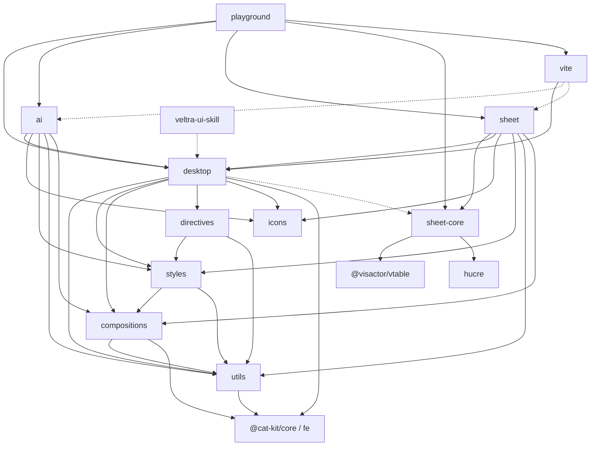

# 代码地图

包内分层与 API 细节读各包 `AGENTS.md`，不要把本文件当文件清单。

## 树

```
ultra-ui/
├── packages/                 # 可发布或占位的库包
│   ├── utils/                # @veltra/utils 工具与共享类型
│   ├── styles/               # @veltra/styles SCSS + theme
│   ├── compositions/         # @veltra/compositions
│   ├── directives/           # @veltra/directives
│   ├── desktop/              # @veltra/desktop 桌面组件主包
│   │   └── src/components/   # 一目录一组件（index.ts + style.ts）
│   ├── sheet-core/           # @veltra/sheet-core
│   │   └── src/{core,grid}/  # 纯 TS 模型 vs VTable 适配
│   ├── sheet/                # @veltra/sheet Vue 电子表格编辑器
│   │   └── src/{components,tools,types}/
│   ├── ai/                   # @veltra/ai
│   │   └── src/{chat,components,providers,tools,types}/
│   ├── icons/                # @veltra/icons（vue/ 为生成物）
│   ├── vite/                 # @veltra/vite resolver
│   └── mobile/               # @veltra/mobile 占位，不发版
├── playground/               # 预览应用 + 参考服务
│   ├── src/                  # desktop / icons / ai / sheet 演示页
│   └── server/               # 填报存取 + DeepSeek 代理（同端口 8787）
├── scripts/                  # 发版、resolver/skill 生成、git 本地配置
├── skills/veltra-ui/         # 对外伴生 Agent Skill
├── .agents/                  # Agent 文档与工程脚本
├── .changeset/               # 版本策略与 changeset 文件
└── vite.config.ts            # monorepo 级 test / lint / fmt / run / staged
```

## 模块

| 模块            | 路径                    | 职责                                                                  | 主要入口                                                    |
| --------------- | ----------------------- | --------------------------------------------------------------------- | ----------------------------------------------------------- |
| utils           | `packages/utils`        | 工具函数、BEM helper、共享类型；无 Vue 组件                           | `src/index.ts`                                              |
| styles          | `packages/styles`       | SCSS mixins/vars/functions、normalize/transitions/animations、主题 TS | `src/_mixins.scss`、`src/theme/index.ts`                    |
| compositions    | `packages/compositions` | Vue 组合式函数（useModel / usePop / useConfig 等）                    | `src/index.ts`（各 `use-*`）                                |
| directives      | `packages/directives`   | `vFocus` / `vClickOutside` / `vRipple`                                | `src/index.ts`                                              |
| desktop         | `packages/desktop`      | 桌面端 UI 主包；`install` 全局注册                                    | `src/index.ts`、`src/install.ts`                            |
| sheet-core      | `packages/sheet-core`   | 表格模型/命令/公式/IO + SheetGrid                                     | `src/index.ts`、`src/grid/index.ts`                         |
| sheet           | `packages/sheet`        | USheet、工具系统                                                      | `src/index.ts`                                              |
| ai              | `packages/ai`           | UAiChat / useChat / transport / UAiOrb                                | `src/index.ts`                                              |
| icons           | `packages/icons`        | SVG → Vue 图标                                                        | `src/index.ts`、`src/normal.ts`、`src/colorful.ts`          |
| vite            | `packages/vite`         | VeltraUIResolver 与生成组件表                                         | `src/resolver.ts`、`src/components.gen.ts`                  |
| mobile          | `packages/mobile`       | 占位，private、changeset ignore                                       | `src/index.ts`                                              |
| playground      | `playground`            | 预览 SPA + 填报/AI 参考实现                                           | `main.ts`、`playground/server/dev.ts`                       |
| scripts         | `scripts`               | resolver/skill 生成、release、setup-git                               | `gen-vite-resolver.ts`、`release.ts`、`gen-veltra-skill.ts` |
| veltra-ui-skill | `skills/veltra-ui`      | 对外 Agent Skill（`bun run skill:gen` 更新）                          | `SKILL.md`                                                  |

## 依赖



虚线：optional peer（desktop→sheet-core；vite→ai/sheet）或生成/文档依赖（skill）。

## 关键路径

1. **宿主按需组件**：Vite 配 `VeltraUIResolver` → 读 `packages/vite/src/components.gen.ts` → 解析 `U*` 到对应包 `components/<name>` 与 `style.ts`。增删组件后必须 `bun run resolver:gen`。
2. **playground 启动**：`cd playground && bun run dev` 同时拉起前端 7788 与参考服务 8787（填报 + `/ai`）。
3. **发版**：changeset → `bun run release`（`dev` 分支）→ GitHub Actions publish。
4. **技能同步**：库 API 变更后 `bun run skill:gen` 更新 `skills/veltra-ui`。
