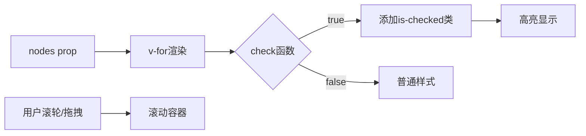

# 完善 ProgressNodes 组件

## 核心设计

### 组件功能

- 渲染节点列表，每个节点可通过 `check` 函数独立判断是否选中
- 支持水平/垂直方向布局
- 节点超出容器后支持鼠标滚轮滚动和拖拽滚动
- 选中节点高亮显示，使用 `ColorType` 颜色

### UI 设计

- 参考 steps 组件布局，但尺寸更小
- 节点图标：小圆点样式（选中时高亮填充）
- 连接线：静态虚线（而非 steps 的动画流动线）
- 整体视觉更轻量、紧凑

## 文件修改

### 1. 类型定义 - [`ui/types/components/progress-nodes.ts`](ui/types/components/progress-nodes.ts)

```typescript

export interface ProgressNodesProps {
  /** 节点列表 */
  nodes: Record<string, any>[]
  /** 检查节点是否选中的函数 */
  check?: (node: ProgressNodeItem, index: number) => boolean
  /** 高亮颜色类型 */
  colorType?: ColorType
  /** 布局方向 */
  direction?: 'horizontal' | 'vertical'
  /** 最大高度（用于垂直方向滚动） */
  maxHeight?: number | string
  /** 最大宽度（用于水平方向滚动） */
  maxWidth?: number | string
  /** 标签键名 */
  labelKey?: string
  /** 值键名 */
  valueKey?: string
  size?: ComponentSize
}
```

### 2. Vue 组件 - [`ui/components/progress-nodes/progress-nodes.vue`](ui/components/progress-nodes/progress-nodes.vue)

主要实现：

- 使用 `v-for` 渲染节点
- 根据 `check` 函数返回值动态添加 `is-checked` 类
- 实现拖拽滚动逻辑（mousedown/mousemove/mouseup）
- 支持滚轮滚动
```vue
<template>
  <div
    :class="className"
    :style="containerStyle"
    ref="container"
    @wheel="handleWheel"
    @mousedown="handleMouseDown"
  >
    <div :class="cls.e('wrapper')" ref="wrapper">
      <div
        v-for="(node, index) in nodes"
        :key="node.key ?? index"
        :class="[cls.e('item'), bem.is('checked', isChecked(node, index))]"
      >
        <div :class="cls.e('node')">
          <i :class="cls.e('link')" v-if="index !== nodes.length - 1"></i>
          <span :class="cls.e('dot')">
            <slot name="icon" :node="node" :index="index" />
          </span>
        </div>
        <div :class="cls.e('label')">
          <slot :node="node" :index="index">
            {{ getLabel(node) }}
          </slot>
        </div>
      </div>
    </div>
  </div>
</template>
```


### 3. 样式文件 - [`ui/components/progress-nodes/style.scss`](ui/components/progress-nodes/style.scss)

关键样式点：

- 尺寸比 steps 更小（节点圆点约 12px，字体更小）
- 连接线使用 `border-style: dashed` 静态虚线
- 选中节点使用 CSS 变量 `--checked-color` 实现高亮
- 容器 `overflow: auto` 支持滚动
- 添加 `cursor: grab/grabbing` 拖拽样式
```scss
@include m.b($root-name) {
  overflow: auto;
  cursor: grab;

  // 颜色变量
  @each $type in vars.$color-types {
    @include m.m($type) {
      --checked-color: #{fn.use-var(color, $type)};
    }
  }

  // 节点样式
  @include m.e(dot) {
    width: 12px;
    height: 12px;
    border-radius: 50%;
    border: 2px solid currentColor;
  }

  // 选中状态
  @include m.bem($root-name, item) {
    @include m.is(checked) {
      color: var(--checked-color);
      @include m.bem($root-name, dot) {
        background-color: var(--checked-color);
      }
    }
  }

  // 连接线 - 静态虚线
  @include m.e(link) {
    border-style: dashed;
    border-color: currentColor;
  }
}
```


## 数据流



## 拖拽滚动实现思路

```typescript
// 记录拖拽状态
const isDragging = ref(false)
const startX = ref(0)
const startY = ref(0)
const scrollLeft = ref(0)
const scrollTop = ref(0)

function handleMouseDown(e: MouseEvent) {
  isDragging.value = true
  startX.value = e.pageX - container.offsetLeft
  startY.value = e.pageY - container.offsetTop
  scrollLeft.value = container.scrollLeft
  scrollTop.value = container.scrollTop
}

function handleMouseMove(e: MouseEvent) {
  if (!isDragging.value) return
  e.preventDefault()
  const x = e.pageX - container.offsetLeft
  const y = e.pageY - container.offsetTop
  container.scrollLeft = scrollLeft.value - (x - startX.value)
  container.scrollTop = scrollTop.value - (y - startY.value)
}
```